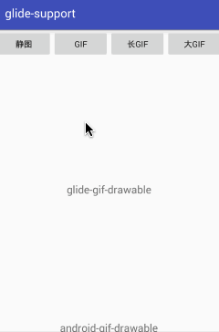

# glide-support
基于[glide](https://github.com/bumptech/glide)与
[android-gif-drawable](https://github.com/koral--/android-gif-drawable)对Glide处理Gif进行加强

## __示例apk__


## __快速开始__
####  Gradle
```
compile 'com.dyhdyh.support:glide-plus:1.0.1'
compile 'com.github.bumptech.glide:glide:3.7.0'
```

#### 示例
```
GlidePlus.with(this)
                .gifPlus()//开启gif增强
                .circle()//圆形
                //.crossFade()//淡入淡出(默认开启)
                //.transform(new ImageWrapperCircleTransformation())
                //.animate(new DrawableScaleBounceAnimator())
                .glide()
                .load(url)
                .placeholder(R.mipmap.placeholder)
                .error(R.mipmap.error)
                .into(iv);
```

## __效果__


## __对比图__


## __在RecyclerView中使用的注意事项__
1.重写Adapter中`onViewDetachedFromWindow`与`onViewAttachedToWindow`，在Item出屏的时候暂停播放gif，进屏的时候再播放gif，这样可以节省一些性能。  

```
@Override
public void onViewDetachedFromWindow(ViewHolder holder) {
    Drawable drawable = holder.iv.getDrawable();
    if (drawable instanceof pl.droidsonroids.gif.GifDrawable){
        ((pl.droidsonroids.gif.GifDrawable) drawable).pause();
    }
}

@Override
public void onViewAttachedToWindow(ViewHolder holder) {
    Drawable drawable = holder.iv.getDrawable();
    if (drawable instanceof pl.droidsonroids.gif.GifDrawable){
        ((pl.droidsonroids.gif.GifDrawable) drawable).start();
    }
}
```


